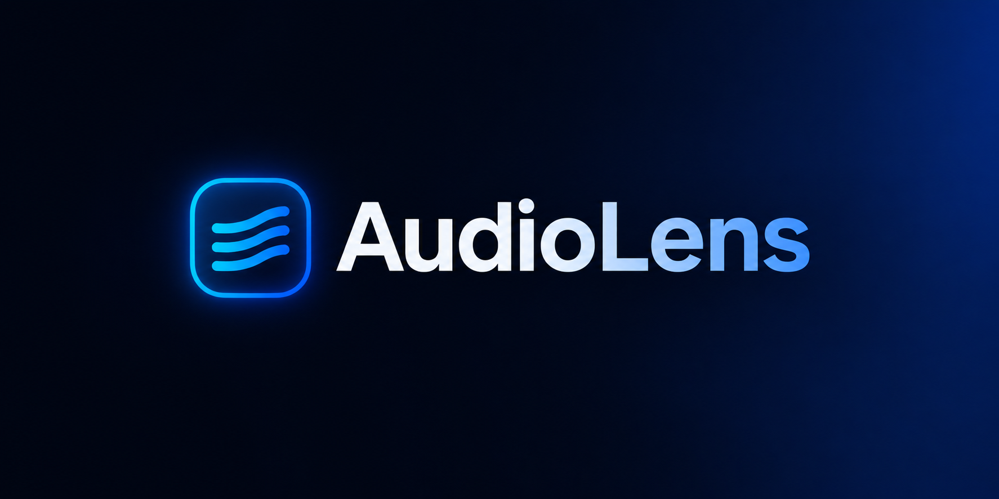

# AudioLens Landing Page

**Purpose:** the purpose of this site is to give users an understanding of what AudioLens is and a guide for using it. It is not a product surface — no app functionality lives here, only explanation and documentation.

> **Status: work in progress.**
> This repo is a UI mockup of the AudioLens landing page and docs page. Copy, screenshots, feature lists, and doc content are placeholders and not final — still configuring, still writing docs. Everything here has to be finalized after AudioLens itself is implemented — the real product behavior will drive the final content.

Main AudioLens repo: [ECHO-Lit/ECHO-LIT](https://github.com/ECHO-Lit/ECHO-LIT)

## Pages

- **Landing** (`/`) — main marketing page, still being iterated on.
- **Docs** (`/docs`) — documentation pages, content still being written and structured.
- **Research** (`/research`) — research/background page, still a placeholder pending final content.

None of these are final — copy, structure, and content across all pages will change as AudioLens itself takes shape.

