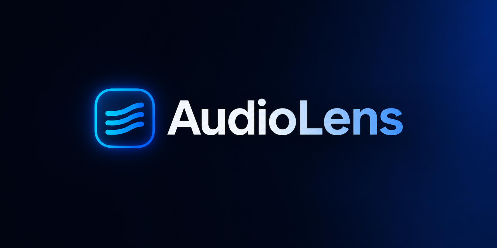

# AudioLens Landing Page



The landing and documentation site for **AudioLens** — an open-source interpretability workbench for speech models (Whisper, Wav2Vec2 and custom Hugging Face checkpoints). This repo is the site only: no app functionality lives here, just explanation, docs and research write-ups. The product itself lives in the main repo.

Main AudioLens repo: [ECHO-Lit/ECHO-LIT](https://github.com/ECHO-Lit/ECHO-LIT)

> **Status:** copy, docs and pages below are real and kept in sync with the product. What's still pending: a public hosted demo (self-hosting is the only option today, see [Self-hosting](https://github.com/ECHO-Lit/ECHO-LIT) docs) and a Research section, which is scaffolded but has nothing published yet.

## Pages

- **Landing** (`/`) — what AudioLens is, how it works, the nine analysis panels, models & datasets, FAQ.
- **Docs** (`/docs`) — full documentation: quickstart, architecture, REST API, each analysis method, licenses, contributing, and more. Content lives in `content/docs/*.mdx`.
- **Research** (`/research`) — papers, benchmarks and write-ups. Placeholder until the first entry is published; article rendering is already wired up.
- **About** (`/about`) — project vision, background and attribution.

## Stack

- **Next.js 16** (App Router, Turbopack) + **React 19** + **TypeScript**
- **Tailwind CSS v4**, shadcn-style primitives (`components/ui/`) on `@base-ui/react`
- **MDX** for docs and research content (`@next/mdx`, `rehype-pretty-code`, `remark-gfm`)
- `next-themes` for light/dark, `lucide-react` icons
- Responsive: desktop-first design, optimized down to phone widths without changing desktop rendering

## Development

```bash
npm install
npm run dev       # http://localhost:3000
```

Other scripts:

```bash
npm run build      # production build
npm run start       # serve the production build
npm run lint        # ESLint
npm run docs:index  # regenerate app/docs/docs-index.generated.ts from content/docs/*.mdx
```

`docs:index` runs automatically before `dev` and `build` (via `predev`/`prebuild`). It parses every `content/docs/*.mdx` file into search records and per-page tables of contents — edit an `.mdx` file and the index picks it up on the next dev/build, no manual step needed.

## Project structure

```
app/                  routes: landing, docs shell + pages, research, about
components/           shared UI (header, footer, panel grid, ui/ primitives)
content/docs/         documentation source (.mdx)
content/research/     research article source (.mdx), currently empty
lib/                  small shared utilities (site URL, theme, cn, etc.)
public/assets/        images, diagrams, logos
scripts/              docs index generator
```

## Contributing

This repo follows the same workflow as the main product: fork, branch (`feature/`, `bugfix/`, `docs/`, `refactor/`), open a PR against `main`. Frontend changes are checked with ESLint. See the [contributing guide](https://github.com/ECHO-Lit/ECHO-LIT) for the full policy and code of conduct.

## License

MIT — see [the licenses page](/docs/licenses) for full attribution, including the original ECHO project this extends.


